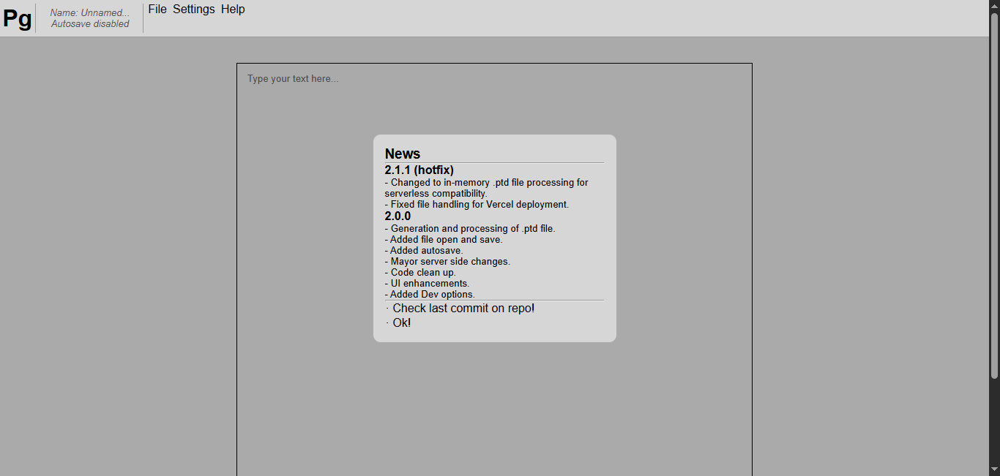
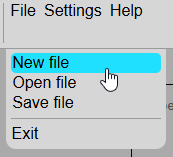

# Paragraph 📰

Simple text processor made in Vanilla JavaScript.

Current version: **2.1.1**

## Getting Started 🎯

### Dependencies / Requirements 🗃️

#### Dependencies

- `Node.js`

#### Requirements

*No additional requirements.*

### Build yourself 🛠️

> [!NOTE] This project doesn't require be build, just a deploy server.

1. Clone the repository:

   `git clone https://github.com/hppsrc/paragraph.git`

2. Navigate to the project directory:

   `cd paragraph`

3. Install dependencies:

   `npm install`

4. Run the project locally:

   `node src/server.js` or `node start`

5. Open your browser and go to:

   `http://localhost:3000`

### Download ⬇️

Using git or [download last zip here](https://github.com/hppsrc/paragraph/archive/refs/heads/main.zip)

### Installing ⚙️

*No installation required.*

### Using Paragraph 💻

<small>Paragraph main window.</small>

### Basic operations

- Save & Load files:

Create new file: ``File > New file``

Open file from your PC: ``File > Open file``

Save file on your PC: ``File > New file``

> [!NOTE] You can enable Developer Menu Tools: ``Enable via Help > About > Enable dev tools``

## Help ❓

Please check the **Wiki** section on the GitHub repository: [Wiki on GitHub](https://github.com/hppsrc/paragraph/wiki)

You can also contribute to the wiki if you want to help improve the documentation.

## License 🔑

This project is licensed under the CC-BY-NC-SA-4.0 license.

## TODO ✔️

- [ ] Implement basic text formatting (bold, italics, underline).
- [ ] Improve the UI.
- [ ] Responsive design.
- [ ] Export functionality.
  - [ ] As PDF.
  - [ ] As docx.

- [x] ~~Add save/load functionality for documents.~~
  - [x] ~~Custom format `.ptd` (Paragraph Text Document)~~

## Known Errors 🐞

If you encounter any issues or need help, please refer to the **Issues** section on the GitHub repository:
[Issues on GitHub](https://github.com/hppsrc/paragraph/issues)
You can also open a new issue if you encounter bugs or need support.

## Version History 🕒

Check [CHANGELOG.md](CHANGELOG).
